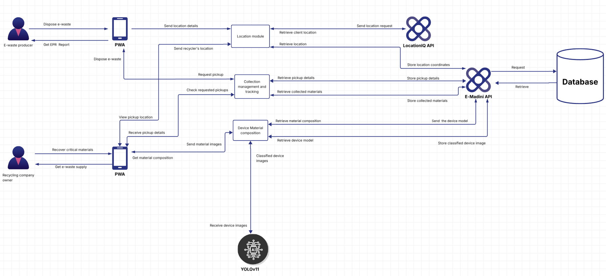
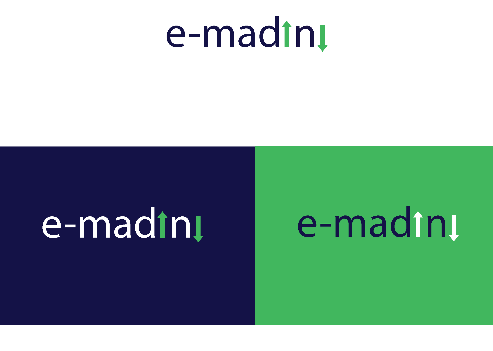

# Architecture

This page describes E-Madini's architecture at the whole-system level the design philosophy behind it, the major components and how they talk to each other, and how the system is expected to grow. For layer-by-layer implementation detail inside the backend specifically.

---

## Core Principles

These are the design decisions that show up consistently across the codebase, not aspirational statements each one is backed by something concretely observable in how the system is built.

**One client, two roles.** Producers and recyclers use the same Progressive Web App (PWA) rather than separate applications the interface adapts to the signed-in user's role instead of the platform maintaining two codebases for two audiences. This keeps the client surface area small and means a feature built once (e.g. the pickup-tracking view) is available to both sides of the marketplace by construction.

**Strict layered separation on the backend.** Every request flows through the same four layers in the same order Router → Schema → Service → Repository and each layer has exactly one job. Routers never touch SQL, repositories never contain business rules. This isn't just a convention; the codebase's file structure enforces it (one router, one service, one repository per resource), which makes it straightforward for a new engineer to find where any given piece of logic lives.

**A single source of truth for shared concepts.** User roles (`producer` / `recycler` / `admin`) and pickup-request statuses are each defined **once**, in `emadini/models/enums.py`, and reused by both the database schema and the API validation layer. There's no risk of the database and the API disagreeing about what a valid role or status looks like.

**Automate the material-intelligence work a human would otherwise do by hand.** Rather than asking a recycler to manually look up what materials a device contains, the platform photographs the device, classifies it with a vision model, and looks up its material composition automatically (see [AI Engine](ai.md)). The guiding idea is turning unorganized, opaque electronic scrap into transparent, structured data with as little manual data entry as possible.

**Fail loudly, not silently.** Missing critical configuration (JWT secret, MFA encryption key, LocationIQ credentials) causes the affected request or in the case of core secrets, the whole application to fail immediately and explicitly, rather than running in a degraded or insecure state.

**Security is load-bearing, not bolted on.** Every login requires MFA, sessions are transported in a way that resists client-side script theft, and every state-changing action is checked against both role and ownership. See [Security](security.md).

---

## System Architecture Diagram

This is the platform-level data flow, how the producer and recycler both interact with the same PWA, and how that PWA talks to the E-Madini API, the two external integrations (LocationIQ and the YOLO classifier), and the database.



At a glance, the diagram shows three journeys running through the same shared components:

1. **The producer's disposal journey**: dispose e-waste → the PWA sends location details to the Location module → the Location module geocodes the address via the LocationIQ API → the coordinates are stored → the request enters the Collection Management and Tracking module → the producer can later retrieve their EPR (disposal) report.
2. **The recycler's collection journey**: the recycler's PWA checks requested pickups and views pickup locations through the same Collection Management and Tracking module, and retrieves the recycler's own location the same way a producer's is resolved.
3. **The shared material-intelligence journey**: either side can send material/device images into the Device Material Composition module, which hands the image to YOLOv11 for classification and returns the recovered material composition, which is then stored via the E-Madini API.

Every one of these journeys converges on the same two integration points **the E-Madini API** (the single backend that every module talks to) and **the Database**.

---

## Component Breakdown

| Component | What it is | What it does | Where it's implemented |
|---|---|---|---|
| **PWA (Producer & Recycler client)** | A single Progressive Web App, shared by both user roles | Presents the disposal/collection workflows appropriate to whichever role is signed in | Frontend: see the [Frontend Web](web.md) 
| **Location Module** | A backend service responsible for turning addresses into coordinates | Sends location requests to LocationIQ, retrieves and stores resolved coordinates, and serves both a producer's and a recycler's location back to the PWA | `emadini/services/location_service.py` see [LocationIQ Integration](backend.md#locationiq-integration) |
| **Collection Management and Tracking** | The pickup-request lifecycle engine | Accepts pickup requests, assigns the nearest available recycler, tracks status (pending → accepted → completed/rejected), and exposes pickup details back to both parties | `emadini/services/pickup_request_service.py` see [Data Models → pickup_request](backend.md#pickup_request) |
| **Device Material Composition** | The AI-assisted material-intelligence module | Receives device images, orchestrates classification and the materials lookup, and returns/stores the recovered composition | `emadini/services/device_model_service.py`, `emadini/ml/`see [AI Engine](ai.md) |
| **E-Madini API** | The FastAPI backend itself | The single point every module (Location, Collection, Device Material Composition) goes through to read or write persisted data | `main.py` + the full `emadini/` package see [Backend Reference](backend.md) |
| **Database** | PostgreSQL | Stores users, locations, pickup requests, device models, and disposal reports | See [Data Models](https://docs.google.com/document/d/1zPRvm_of4BKhYtEVbAssXGb_Ui8bDXmn1xSCOZOwiyQ/edit?tab=t.unrp0r90be22) |
| **LocationIQ API** | External geocoding provider | Converts a plain-text address into latitude/longitude | Third-party service, called from the Location module |
| **YOLOv11** | External/embedded computer-vision classifier | Classifies an uploaded device photo into a device category | Model weights (`best.pt`) loaded via `ultralytics.YOLO` see [AI Engine → Models Used](ai.md#models-used). (The current codebase refers to this generically as "YOLO"; confirm the exact version v8 vs. v11 against the training pipeline if that distinction matters for the record, since different parts of the project's diagrams and code comments use different version numbers.) |

---

## Data Flow

### 1. E-waste disposal → pickup assignment

```text
Producer disposes e-waste (submits an address)
        │
        ▼
PWA sends location details → Location Module
        │
        ▼
Location Module sends a location request → LocationIQ API
        │
        ▼
LocationIQ resolves lat/lon → Location Module retrieves it
        │
        ▼
Coordinates stored in the Database
        │
        ▼
Pickup request created in the Collection Management and Tracking module,
nearest active recycler auto-assigned by distance
        │
        ▼
Recycler's PWA can "Check requested pickups" / "View pickup location"
```

### 2. Device scan → material composition

```text
Recycler sends material/device images → Device Material Composition module
        │
        ▼
Image forwarded to YOLOv11 → device classified (device_type + confidence)
        │
        ▼
Classified result used to retrieve material composition (materials lookup)
        │
        ▼
Composition + classified device image stored via the E-Madini API → Database
        │
        ▼
Recycler's PWA displays "Get material composition"
```

### 3. Completed pickup → EPR / disposal report

```text
Recycler marks a pickup as complete (Collection Management and Tracking)
        │
        ▼
E-Madini API generates a disposal report (PDF) and stores it
        │
        ▼
Producer's PWA requests "Get EPR Report"
        │
        ▼
Report retrieved from the Database and returned as a downloadable file
```

Across all three flows, note that the **PWA never talks to LocationIQ or YOLOv11 directly** — every external integration is mediated by the E-Madini API's relevant module. This keeps API keys and model weights entirely server-side and gives the backend a single place to apply auth, validation, and error handling before any external call is made.

---

## Design Guidelines

Brand and UI conventions:

| Color pallete | Value | Used for |
|---|---|---|
| Primary color Dark Blue | `#151635` | Navigation, headings, primary typography, footer background |
| Accent color  Green | `#44B75E` | Buttons, links, active states, success/info/warning indicators |
| Code block background | `#F8F8FA` | Inline and block code styling |
| Typeface (UI text) | Poppins (falling back to Segoe UI, Arial, sans-serif) | All body and heading text |

### Logo Design



---
## Scalability Strategy

Being direct about what's actually true today versus what would need to change to scale further:

### What the current architecture already supports

- **Stateless authentication.** Sessions are JWTs, not server-side session objects any backend instance can validate a token without needing to share in-memory state with the instance that issued it. This means the API layer itself can, in principle, be horizontally scaled (multiple Heroku dynos) without a sticky-session requirement.
- **Shared state lives in Redis, not in-process memory.** OTP attempt counters, replay guards, and password-reset tokens are stored in Upstash Redis rather than a local dictionary so multiple backend instances already share this state correctly, which is a prerequisite for running more than one dyno.

### Real constraints that limit scaling today

- **Local disk file storage.** Uploaded e-waste photos and generated disposal-report PDFs are currently written to the dyno's local filesystem (`uploads/`, `reports/`). This works for a single dyno, but breaks under horizontal scaling a file written by one dyno wouldn't be visible to a request served by another, and Heroku's filesystem is ephemeral regardless (see [Security → Local/offline storage](security.md#localoffline-storage)). This has to move to shared object storage (e.g. S3-compatible storage) before running more than one web dyno.
- **The AI model is loaded in process, per dyno.** `emadini/ml/classifier.py` loads YOLO weights into memory at import time. Running N dynos means N copies of the model in memory fine at small scale, but a real per-instance memory cost that compounds as dyno count grows. If AI usage becomes a bottleneck, that argues for splitting device classification out into its own service that the API calls over the network, rather than continuing to load the model into every API process.