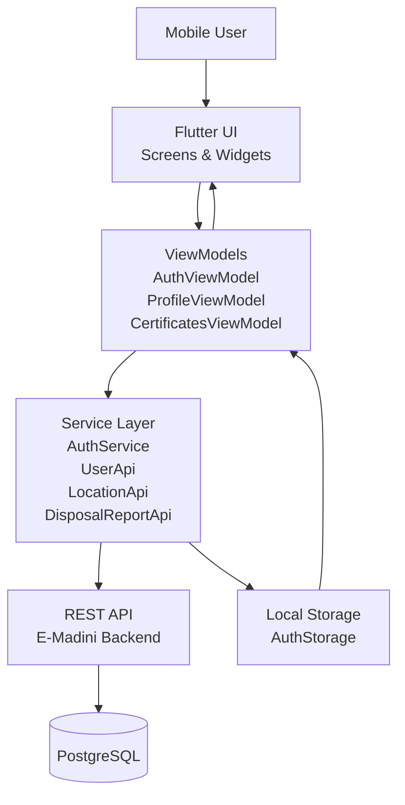
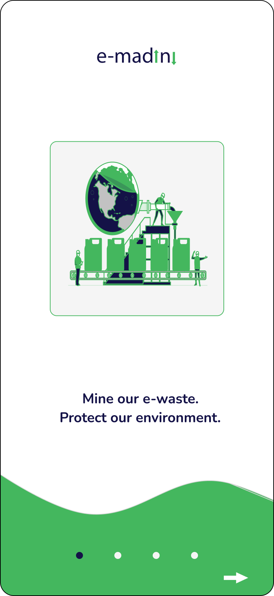
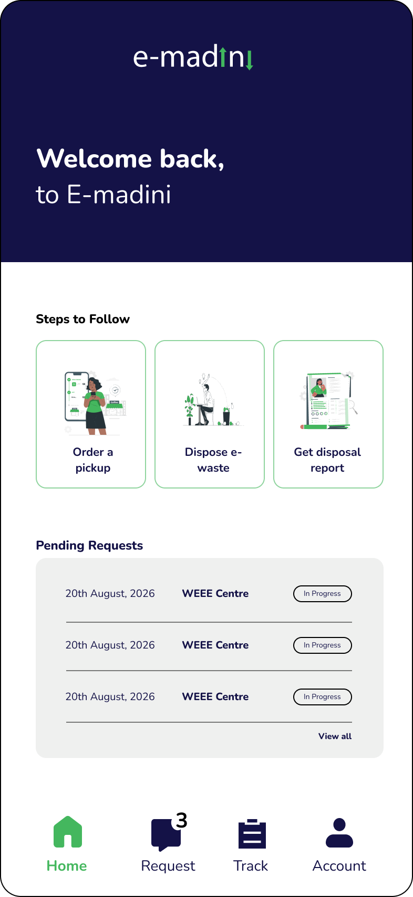

# Frontend Mobile Application

The E-Madini mobile application provides the primary mobile interface for producers and recycling stakeholders to interact with the platform. It combines a Flutter-based user interface with REST API services to provide authentication, account management, pickup request workflows, location services, and disposal certificate access.

The application is designed around a separation of presentation, state management, service communication, and data representation. This structure allows individual application features to evolve without coupling the user interface directly to backend implementation details.

---

## Mobile Application Overview

The mobile application provides the following capabilities:

- User onboarding and authentication
- Sign in and account registration
- OTP verification
- Authenticated session management
- Producer profile management
- Location information
- Pickup request submission and tracking
- Request status and completion flows
- Disposal certificate retrieval
- Certificate details and PDF access
- API-based communication with the E-Madini backend
- Persistent authentication state
- Navigation between application modules

The application communicates with the E-Madini backend through REST APIs and uses authenticated requests for protected resources.

---

## Technology Stack

| Layer | Technology |
| :--- | :--- |
| **Application Framework** | Flutter |
| **Programming Language** | Dart |
| **State Management** | Provider |
| **API Communication** | HTTP / REST |
| **Authentication** | JWT Bearer Tokens |
| **Local Storage** | Shared Preferences |
| **Navigation** | Flutter Named Routes |
| **Typography** | Google Fonts |
| **Image Selection** | Image Picker |
| **Backend Integration** | FastAPI REST API |
| **Version Control** | Git / GitHub |
| **Platform Support** | Android, iOS, Web, Desktop |

Flutter provides the application framework while Dart is used for the presentation layer, application logic, state management, and service integrations.

---

# Mobile Architecture

The mobile application follows a layered architecture that separates the user interface from application state, API communication, and data representation.



### Request Flow

A typical authenticated operation follows this sequence:

```text
User Interaction
       |
       v
Flutter Screen
       |
       v
ViewModel / Application State
       |
       v
Service Layer
       |
       v
HTTP Request
       |
       v
E-Madini REST API
       |
       v
Backend Service
       |
       v
Response
       |
       v
ViewModel
       |
       v
Flutter UI
```

This separation prevents screens from containing the application's complete business and networking logic.

---

# Application Structure

The mobile source code is organized around screens, models, services, and view models.

```text
lib/
│
├── model/
│   ├── location.dart
│   └── user.dart
│
├── models/
│   ├── login_response.dart
│   ├── pickup_request.dart
│   ├── recycling_request.dart
│   ├── token_response.dart
│   └── user.dart
│
├── screens/
│   ├── onboarding/
│   ├── request/
│   ├── certificates_screen.dart
│   ├── home_screen.dart
│   ├── otp_verification_screen.dart
│   ├── profile_screen.dart
│   ├── request_status_screen.dart
│   ├── signin_screen.dart
│   └── signup_screen.dart
│
├── service/
│   ├── auth_storage.dart
│   ├── disposal_report_api.dart
│   ├── location_api.dart
│   └── user_api.dart
│
├── services/
│   └── auth_service.dart
│
├── view_model/
│   ├── auth_view_model.dart
│   ├── profile_view_model.dart
│   └── certificates_view_model.dart
│
├── routes/
│   └── app_router.dart
│
└── main.dart
```

The structure separates presentation components from API communication and application state.

---

# Application Entry Point

The application is initialized from `main.dart`.

The root application registers the state providers required by the application before rendering the main application widget.

```dart
runApp(
  MultiProvider(
    providers: [
      ChangeNotifierProvider(
        create: (_) => AuthViewModel(),
      ),
      ChangeNotifierProvider(
        create: (_) => ProfileViewModel(),
      ),
      ChangeNotifierProvider(
        create: (_) => CertificatesViewModel(),
      ),
    ],
    child: const MyApp(),
  ),
);
```

The application state controllers are registered through the provider tree:

| ViewModel | Responsibility |
| :--- | :--- |
| `AuthViewModel` | Authentication and authentication state |
| `ProfileViewModel` | User profile and profile-related state |
| `CertificatesViewModel` | Disposal certificate retrieval, loading state, errors, and downloads |

Using `MultiProvider` allows the application to maintain multiple independent state objects while keeping them accessible throughout the widget tree.

---

# Navigation

Application navigation is centralized through the application's route configuration.

The routing layer provides navigation between major application states and screens, including:

```text
Onboarding
    |
    v
Authentication
    |
    +---- Sign In
    |
    +---- Sign Up
    |
    +---- OTP Verification
    |
    v
Home
    |
    +---- Pickup Requests
    |
    +---- Request Status
    |
    +---- Profile
    |
    +---- Certificates
```

Centralized navigation reduces direct dependencies between screens and provides a consistent mechanism for moving between application modules.

---

# Authentication

Authentication is implemented as a multi-stage workflow.

```text
Credentials
     |
     v
Sign In / Sign Up
     |
     v
Authentication API
     |
     v
OTP Verification
     |
     v
Access Token
     |
     v
Secure Session Storage
     |
     v
Authenticated Application
```

## Sign In

The sign-in screen collects the user's credentials and submits them through the authentication state layer.

The authentication service communicates with the backend using an HTTP POST request.

```text
POST /auth/login
```

The successful response provides authentication information used to establish the application session.

---

## Sign Up

New users can create an account by providing the required account information.

The registration request contains information such as:

- Organization name
- Email address
- Phone number
- Password
- Address
- User role

The mobile application submits the information to the backend and processes the returned account information.

---

## OTP Verification

OTP verification provides an additional authentication step after the initial authentication request.

The mobile application sends the OTP together with the authentication token required by the verification endpoint.

```text
POST /auth/verify-otp
```

A successful verification returns an access token that can be used for authenticated requests.

---

# Session Management

Authentication state is maintained through a dedicated storage service.

`AuthStorage` is responsible for persisting and retrieving the authentication token required by protected API requests.

The general session lifecycle is:

```text
Authentication
      |
      v
Access Token
      |
      v
AuthStorage
      |
      +--------------------+
      |                    |
      v                    v
Authenticated        Application
API Requests             State
      |
      v
Logout
      |
      v
Token Cleared
```

When the user logs out, the stored authentication token is cleared and the application returns to the authentication flow.

---

# State Management

The application uses the Provider package with `ChangeNotifier`-based view models.

State management separates UI rendering from application operations.

## Authentication State

`AuthViewModel` manages authentication-related operations including:

- Sign in
- Sign up
- OTP verification
- Loading state
- Authentication errors
- Authentication responses

The UI observes the state and updates according to the current authentication operation.

---

## Profile State

`ProfileViewModel` manages authenticated user profile information.

Its responsibilities include:

- Loading the authenticated user's profile
- Retrieving user information
- Retrieving location information
- Maintaining loading state
- Exposing errors to the UI
- Updating UI state when profile data changes

The profile screen consumes the view model rather than directly managing the complete API request lifecycle.

---

# API Integration

The mobile application communicates with the E-Madini backend through dedicated service classes.

| Service | Responsibility |
| :--- | :--- |
| `AuthService` | Authentication and OTP operations |
| `UserApi` | User information and profile operations |
| `LocationApi` | Location-related operations |
| `DisposalReportApi` | Disposal report and certificate operations |
| `AuthStorage` | Authentication token persistence |

This service-oriented approach prevents API implementation details from being embedded directly inside presentation widgets.

---

# Authentication API

The authentication service communicates with the backend using HTTP requests.

### Login

```text
POST /auth/login
```

The request submits authentication credentials and processes the returned authentication response.

### OTP Verification

```text
POST /auth/verify-otp
```

The endpoint validates the submitted OTP and returns an access token after successful verification.

### Current User

```text
GET /users/me
```

Authenticated requests include the access token using the Bearer authentication scheme.

```text
Authorization: Bearer ACCESS_TOKEN
```

### User Registration

```text
POST /users/
```

The endpoint creates a new producer account using the registration information supplied by the mobile application.

---

# Profile Module

The Profile module provides authenticated users with access to their account information and account actions.

The module includes:

- Organization information
- Email address
- Phone number
- Location information
- Account information
- Profile state
- Logout functionality

The profile workflow is:

```text
Profile Screen
      |
      v
ProfileViewModel
      |
      +----------+
      |          |
      v          v
   UserApi   LocationApi
      |          |
      +-----+----+
            |
            v
      REST API
            |
            v
      Profile State
            |
            v
       Profile UI
```

This structure allows profile information to be retrieved asynchronously while keeping the screen focused on presentation.

---

# Logout

Logout is implemented as an explicit user action.

The workflow is:

```text
Profile
  |
  v
Logout
  |
  v
Confirmation
  |
  v
Clear Authentication Token
  |
  v
Authentication Flow
```

Clearing the stored token prevents subsequent authenticated requests from reusing the previous session.

---

# Pickup Request Module

The pickup request module provides the workflow through which producers submit and track collection requests.

The general flow is:

```text
Pickup Request
      |
      v
Request Details
      |
      v
Request Submission
      |
      v
Backend API
      |
      v
Request Status
      |
      v
Pickup Completion
```

The mobile interface separates the request creation process from request status and completion screens, allowing each stage of the workflow to present the information relevant to that state.

---

# Home Module

The Home screen provides the primary navigation point after authentication.

It connects users to the major application capabilities, including:

- Pickup requests
- Request tracking
- Profile
- Certificates
- Other application functionality

The Home screen therefore acts as the main application shell rather than containing the implementation of each feature itself.

---

# Disposal Certificates

The Certificates module provides authenticated users with access to disposal and processing certificates associated with their activities.

The certificate workflow is:

```text
Certificates
      |
      v
Disposal Reports API
      |
      v
Available Certificates
      |
      v
Certificate Details
      |
      v
View / Download
      |
      v
Generated PDF
```

The mobile application retrieves certificate information from the backend rather than relying on hardcoded certificate data.

---

## Certificate API

The certificate module uses disposal report endpoints including:

```text
GET /disposal-reports
GET /disposal-reports/{REQUEST_ID}
GET /disposal-reports/{REPORT_ID}/download
```

The first endpoint retrieves available disposal reports.

The second retrieves the details of an individual report.

The download endpoint provides access to the generated certificate document.

---

# Certificate Information

A certificate can contain information associated with the completed disposal process, including:

| Information | Purpose |
| :--- | :--- |
| Certificate ID | Identifies the certificate |
| Date | Records the certificate date |
| Recycling Centre | Identifies the processing location |
| Quantity | Records the quantity collected or processed |
| Pickup Location | Identifies the collection location |
| PDF | Provides the generated certificate document |

The certificate screen presents this information in a structured interface before allowing the user to view or download the document.

---

# User Interface

The E-Madini mobile application uses a consistent visual design across its main workflows. The interface combines the application's navy and green brand colours with card-based layouts, clear navigation, and mobile-friendly controls.

## Selected Mobile Screens

The following screenshots represent selected stages of the E-Madini mobile application.

### Onboarding



*Figure: E-Madini mobile onboarding interface.*

The onboarding experience introduces users to the platform and its electronic-waste management purpose before authentication.

### Producer Home



*Figure: E-Madini producer home dashboard.*

The Home screen provides access to the main producer workflows, including pickup requests, disposal activities, request tracking, and account management.

---

# Application Navigation

The application organizes authenticated functionality around the primary application navigation.

Major destinations include:

```text
Home
  |
  +-- Pickup Request
  +-- Request Status
  +-- Certificates
  +-- Profile
```

Each destination is implemented as an independent screen while sharing application state and services where required.

---

# Profile Interface

The Profile screen provides authenticated account information and account management actions.

Profile data is retrieved from the backend through the profile state management layer.

The UI therefore remains independent of the underlying HTTP implementation.

---
# Error Handling

The mobile application handles errors at the service and state-management layers before exposing appropriate feedback to the UI.

Common error categories include:

- Invalid authentication credentials
- Invalid OTP
- Missing authentication token
- Failed API requests
- Unexpected API responses
- Network connectivity failures
- Missing profile information
- Certificate retrieval failures

The general error flow is:

```text
API Request
    |
    v
Response
    |
    +---- Success ----> Application State ----> UI
    |
    +---- Error ------> Exception / Error State
                                  |
                                  v
                              UI Feedback
```

This prevents low-level HTTP implementation details from being exposed directly to presentation components.

---

# Security Considerations

The mobile application follows several security-oriented practices when interacting with protected backend resources.

## Token-Based Authentication

Protected API requests use Bearer authentication.

```text
Authorization: Bearer ACCESS_TOKEN
```

The access token is persisted through the authentication storage layer and removed when the user logs out.

## Protected Resources

Profile information and disposal reports are retrieved through authenticated requests.

The application does not treat protected resources as publicly accessible data.

## Session Termination

Logout clears the locally stored authentication token, preventing the previous session from being reused by the application.

---

# Testing and Verification

The mobile application is verified through both static analysis and functional testing.

## Static Analysis

Flutter's analyzer is used to identify code issues before changes are integrated.

```bash
flutter analyze
```

A successful analysis should return:

```text
No issues found!
```

---

## Authentication Verification

The authentication workflow can be verified by:

1. Opening the application.
2. Creating or using a valid account.
3. Signing in with valid credentials.
4. Completing OTP verification where required.
5. Confirming successful navigation to the authenticated application.
6. Opening the Profile screen.
7. Confirming authenticated profile information is displayed.

---

## Profile Verification

The profile workflow can be verified by:

1. Signing in with a valid account.
2. Opening Profile.
3. Confirming that user information loads from the API.
4. Confirming location information is displayed where available.
5. Selecting Logout.
6. Confirming the logout action.
7. Confirming the authentication session is cleared.

---

## Certificate Verification

The certificate workflow can be verified by:

1. Signing in with an authenticated account.
2. Opening Certificates.
3. Confirming available disposal reports are retrieved.
4. Selecting a certificate.
5. Confirming certificate information is displayed.
6. Selecting View or Download.
7. Confirming that the generated certificate document is accessible.

---

# Development Workflow

Mobile development follows the repository's Git-based workflow.

Feature work is developed in dedicated branches before being reviewed and merged.

A typical workflow is:

```text
Create Feature Branch
        |
        v
Implement Feature
        |
        v
Run Flutter Analysis
        |
        v
Review Changes
        |
        v
Commit
        |
        v
Push Branch
        |
        v
Open Pull Request
        |
        v
Code Review
        |
        v
Merge
```

The mobile application is maintained alongside the backend and web components within the E-Madini project ecosystem.

---

# Architecture Summary

The mobile application uses a layered approach to maintain separation of concerns.

| Layer | Responsibility |
| :--- | :--- |
| **Presentation** | Screens and widgets |
| **State** | View models and observable application state |
| **Services** | REST API communication |
| **Storage** | Authentication token persistence |
| **Models** | Structured application data |
| **Routing** | Screen navigation |
| **Backend** | Business logic, persistence and protected APIs |

The resulting architecture can be summarized as:

```text
┌──────────────────────────────────────┐
│              E-Madini                │
│          Flutter Mobile App          │
├──────────────────────────────────────┤
│ Presentation                         │
│ Screens • Widgets • Navigation       │
├──────────────────────────────────────┤
│ State Management                     │
│ AuthViewModel • ProfileViewModel • CertificatesViewModel     │
├──────────────────────────────────────┤
│ Service Layer                        │
│ Auth • User • Location • Reports     │
├──────────────────────────────────────┤
│ Local Session Storage                │
│ AuthStorage                          │
├──────────────────────────────────────┤
│ REST API                             │
│ E-Madini FastAPI Backend             │
└──────────────────────────────────────┘
```

This architecture provides a clear boundary between presentation, state, networking, and backend services while allowing individual modules to evolve independently.

---

# Conclusion

The E-Madini mobile application provides an authenticated Flutter interface for interacting with the platform's recycling workflows. Its architecture separates presentation, state management, service communication, and local session storage, allowing the application to remain maintainable as additional functionality is introduced.

The mobile application integrates authentication, user profiles, pickup workflows, location services, disposal reporting, and certificate access into a unified application experience while maintaining communication with the E-Madini backend through REST APIs.
