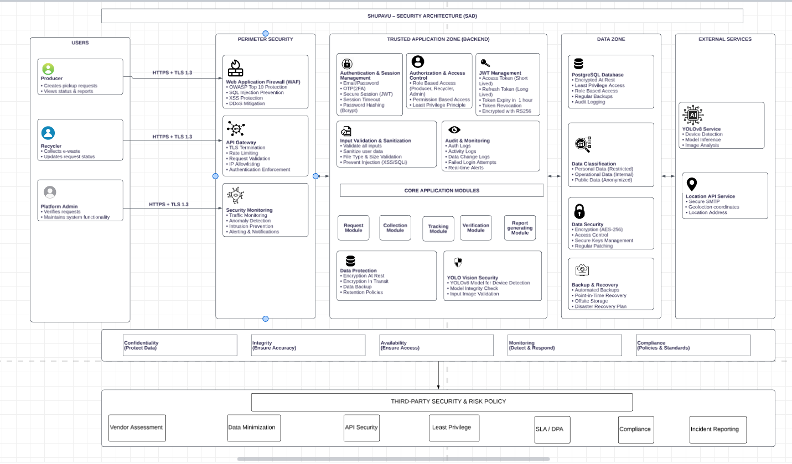

# Security

This page documents E-Madini's security posture, what's implemented and how. Deep implementation detail (code, request flows) for authentication lives in [Backend Reference → Authentication](backend.md#authentication); this page is the consolidated, audit-style view across the whole system.

The diagram below shows the security zones the platform is architected around perimeter security (WAF, API gateway, security monitoring), the trusted application zone (authentication, authorization, input validation, audit logging, the core modules, and YOLO input validation), the data zone (PostgreSQL, data classification, data security, backup/recovery), and external services (the YOLOv8 inference service and the LocationIQ integration), bounded by the CIA-triad goals and a third-party risk policy layer.

---

## Security Architecture Diagram

---

## Security Posture Summary

| Area | Status |
|---|---|
| Password storage | bcrypt hashing, never plaintext |
| Multi-factor authentication | Mandatory email OTP on every login |
| Session transport | httpOnly, `secure` cookie (mitigates JS-based token theft, HTTPS-only) |
| OTP replay/brute-force protection | Redis-backed, 5-attempt lockout, 1-minute token life |
| Secrets management | Environment variables, fail-fast validation at startup |
| Secrets in source control | `.env` git-ignored |
| Transport encryption (cookie `secure` flag) | `secure=True`, enforced over HTTPS in production |
| CORS | Scoped to an explicit allow-list of known frontend/mobile origins |
| File upload validation | Content-type allow-list, file-signature check, and size limits enforced on both upload endpoints |
| Rate limiting (general API) | Application-wide request throttling in addition to OTP-specific limits |
| Database encryption at rest | Enabled at the hosting/database provider level |
| Automated security testing | Test suite covers auth/MFA flow, RBAC, and the pickup-request state machine |
| Web Application Firewall / API gateway | WAF/CDN layer in front of the application |

---

## Data Classification

E-Madini's data falls into these tiers:

| Tier | Data | Where it lives | Handling |
|---|---|---|---|
| **Secret** | Passwords, JWT signing key, MFA encryption key, SMTP/Redis/LocationIQ credentials | `.env` (git-ignored), Heroku Config Vars | Never logged, never returned by any API response, never committed |
| **Sensitive / PII** | Email, phone number, organization name, physical address, geocoded coordinates | `users`, `location` tables | Only exposed to the user themselves or an admin (see [RBAC](backend.md#role-based-access-control)) |
| **Operational** | Pickup requests, device scans, disposal reports, uploaded e-waste photos | `pickup_request`, `devicemodel`, `disposal_report` tables, `uploads/` and `reports/` directories | Scoped to the producer/recycler party to the record, or an admin |
| **Public** | Nothing in the current API is intentionally public except `GET /` (a static welcome message) | — | — |

**A note on location data specifically:** every user and pickup request is tied to a geocoded lat/lon (via [LocationIQ](backend.md#locationiq-integration)). This is precise enough to be personally identifying (e.g. a producer's home or business address) and is treated as PII, not just operational metadata.

---

## Network Security

A WAF/CDN layer sits in front of the Heroku-hosted application, providing DDoS mitigation and basic bot filtering ahead of the API itself. Application-level rate limiting is also in place, covering general API traffic in addition to the OTP-specific throttling on `/auth/verify-otp`.

### CORS

`main.py`'s CORS configuration is scoped to an explicit allow-list of known frontend and mobile origins (rather than a wildcard), matched with `allow_credentials=True`, the combination that's valid per the CORS spec, since credentialed cross-origin requests require a specific origin, not `"*"`.

---

## Application Security

### Authentication

Full detail (JWT claims, OTP flow, cookie configuration) is documented in [Backend Reference → Authentication](backend.md#authentication). Summary of the security-relevant properties:

- Every login requires a valid password **and** a 6-digit email OTP, single-factor login is not possible.
- OTPs are compared with `secrets.compare_digest()` (timing-safe), not `==`.
- OTP tokens are Fernet-encrypted, self-expire after 60 seconds, are single-use (Redis replay guard), and are rate-limited to 5 attempts before the user must log in again.
- The session token is delivered as an **httpOnly**, **secure** cookie, never exposed to `document.cookie` or readable by injected JavaScript, and only ever transmitted over HTTPS.

### Input validation

All request bodies are validated by **Pydantic schemas** before reaching any business logic, malformed requests never reach the database layer; FastAPI rejects them with `422` automatically. Examples of validation actually enforced:

- Passwords: 8–128 characters (`UserCreate.password`)
- Phone numbers: must match the Kenyan MSISDN pattern `^\+254[17]\d{8}$`
- Email: normalized (lower-cased, stripped) via a SQLAlchemy `@validates` hook on the `User` model, so lookups are always case-insensitive and duplicate-safe

### File upload security

Two endpoints accept file uploads: `POST /pickup-requests/upload-image` (producer e-waste photos) and `POST /device-models/scan` (recycler device photos, fed to the AI classifier).

Both endpoints:

- Store uploads under a freshly generated UUID filename (never the client-supplied filename), preventing path traversal and filename-collision attacks.
- Validate `file.content_type` against an image allow-list (`image/jpeg`, `image/png`) before the file is written to disk.
- Verify the actual file signature (magic bytes), not just the declared content-type or extension, before treating the upload as a valid image.
- Enforce a maximum upload size, rejecting oversized files before they're fully written to disk.

### AI-specific input handling

The `/device-models/scan` endpoint passes the uploaded file into the YOLO classifier (see [AI Overview](ai.md)) only after it has passed the file-upload validation described above, so the model only ever receives a verified image.

---

## Data Security

### Database

- Connection is via `DATABASE_URL`, provided by the hosting environment (Heroku attaches this automatically when a Postgres add-on is provisioned).
- **Encryption at rest** is enabled at the hosting/database provider level.

### Secrets management

Covered in detail in [Backend Reference → Setup & Installation](backend.md#setup&installation). Summary:

- All secrets are supplied via environment variables `SECRET_KEY`, `ALGORITHM`, and `MFA_ENCRYPTION_KEY` are validated at **application startup**, and the app refuses to boot if any are missing (fail-fast, not fail-open).
- `.env` is excluded from version control via `.gitignore`.

### Local/offline storage

Uploaded images (`uploads/`) and generated disposal-report PDFs (`reports/`) are stored in persistent object storage rather than the application dyno's local filesystem, so they survive deploys and dyno restarts.

---

## Webhook Security

**Not applicable currently**: the backend does not send or receive webhooks. If a future integration (e.g. a payment provider, SMS gateway) introduces one, it should verify the provider's signature header before trusting the payload, and this section should be updated with the specific mechanism used.

---

## Physical Security

**Not applicable at the application level**: E-Madini's backend runs entirely on managed cloud infrastructure (Heroku, Upstash, LocationIQ); there is no on-premises hardware to secure. Physical security of underlying infrastructure is delegated to those providers' own compliance posture (e.g. Heroku/Salesforce data center certifications).

---

## Incident Response

- Application errors are captured with an error-tracking integration, giving structured context beyond raw Heroku logs.
- A documented process exists for rotating `SECRET_KEY` and `MFA_ENCRYPTION_KEY` (redeploying with new env vars) and for force-invalidating active sessions if needed.
- A basic on-call/escalation path is documented for the team.

---

## Risk Management

| Vendor / Dependency | Role | Risk if unavailable |
|---|---|---|
| **Heroku** | Hosting, Postgres, deployment | Full outage no fallback host configured |
| **Upstash Redis** | OTP attempt tracking, replay guards, password-reset tokens | Login and password reset both fail closed (requests error out rather than silently skipping MFA) |
| **LocationIQ** | Address geocoding | Blocks `POST /locations/` **and** new pickup-request creation (see [LocationIQ Integration](backend.md#locationiq-integration)) |
| **SMTP provider** | OTP delivery, password-reset emails | Users cannot complete login or reset a password, MFA is mandatory, so this is a hard dependency |

Vendor security posture (sub-processor agreements, compliance reports) for these providers has been reviewed as part of standard vendor oversight.

---

## Conclusion

E-Madini's backend security posture covers authentication (hashed passwords, mandatory MFA, httpOnly/secure session cookies), transport and network hardening (scoped CORS, WAF/CDN, rate limiting), data protection (encryption at rest, persistent and access-scoped file storage), and operational readiness (error tracking, key-rotation process, automated tests covering the core auth and business-logic flows). Ongoing work should focus on maintaining this posture as new features are added any new endpoint, especially one accepting user input or files, should be held to the same validation and access-control standard documented above.

