# Frontend Web Portal

E-Madini's web presence is made up of two separate Next.js applications: the **Recycler Dashboard**, an authenticated application used by recycling companies to manage devices, pickup orders, and material analysis, and the **Informational Website**, the public-facing marketing site that introduces E-Madini to producers, recyclers, and partners.

Both applications are built with **Next.js (App Router)** and are deployed independently on **Vercel**, but they share the same brand system and communicate with the same FastAPI backend.

🔗 **Live Website:** [Shupavu Informational Website](https://shupavu-website.vercel.app/)
🔗 **Live Dashboard:** [Shupavu Dashboard](https://shupavu-dashboard-eq1o.vercel.app/)

---

## Frontend Web Overview

The web layer is responsible for:

- Recycler authentication (signup, signin, OTP verification, password reset)
- Session/route protection for authenticated dashboard pages
- Onboarding for new recycler organizations
- Device scanning and material analysis workflows
- Pickup order management and status tracking
- Recycler profile management
- Public marketing content: product overview, about, team, and contact
- Presenting the E-Madini brand consistently across both applications
- End-to-end verification of critical user flows via automated tests

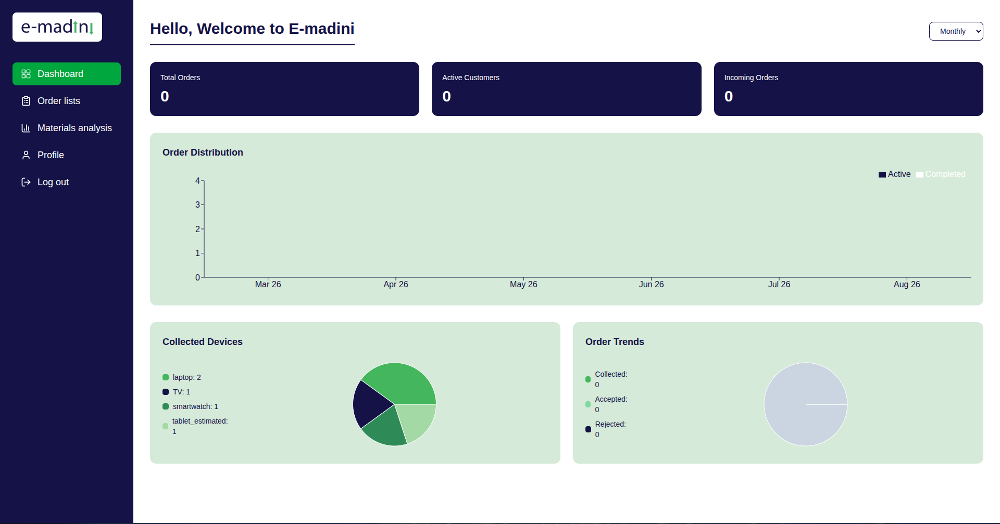
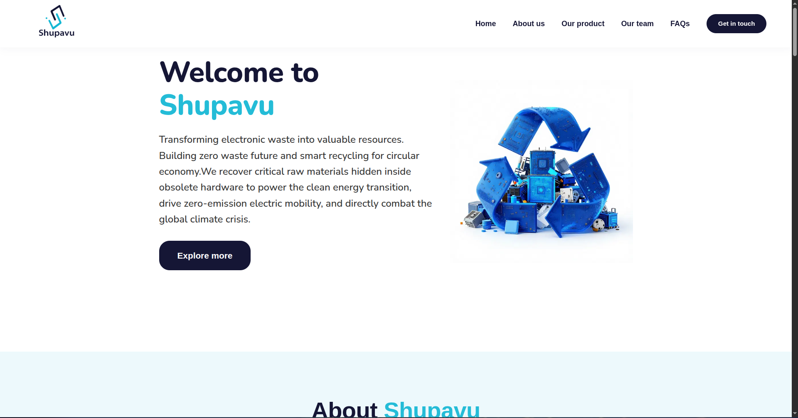

---

## Technology Stack

| Layer | Recycler Dashboard | Informational Website |
| :--- | :--- | :--- |
| **Framework** | Next.js (App Router) | Next.js (App Router) |
| **Language** | TypeScript | JavaScript (JSX) |
| **Styling** | CSS Modules + global stylesheet | CSS Modules + CSS custom properties (design tokens) |
| **Auth Storage** | JWT stored in `localStorage` | N/A (no authenticated areas) |
| **Route Protection** | `middleware.ts` + `RequireAuth` component | N/A |
| **API Communication** | Fetch API, wrapped in a `lib/` client | Formspree (contact form) |
| **Testing** | Playwright (end-to-end) | Manual / visual QA |
| **Linting/Formatting** | ESLint, Prettier | ESLint, Prettier |
| **Deployment** | Vercel | Vercel |
| **Version Control** | Git / GitHub | Git / GitHub |

---

# Architecture

Both applications follow the standard Next.js App Router request model, where each folder under `app/` maps to a route segment.

```text
Browser
   |
   v
Next.js App Router
   |
   v
Route Segment (page.tsx / page.jsx)
   |
   v
Client / Server Components
   |
   v
Data Fetching (lib/ API client)
   |
   v
FastAPI Backend
```

For the Recycler Dashboard specifically, protected routes pass through an additional authentication layer before rendering:

```text
Request
   |
   v
middleware.ts
   |
   v
RequireAuth (client guard)
   |
   +--> Token missing/invalid --> redirect to /signin
   |
   +--> Token present --> render protected page
```

---

# Project Structure

## Recycler Dashboard

```text
Shupavu_Dashboard/
│
├── app/
│   │
│   ├── (auth)/
│   │   ├── forgot-password/
│   │   ├── onboarding/
│   │   ├── reset-password/
│   │   ├── signin/
│   │   ├── signup/
│   │   ├── splash/
│   │   ├── verify-otp/
│   │   └── global.module.css
│   │
│   ├── dashboard/
│   ├── DeviceScan/
│   ├── materials-analysis/
│   ├── orders/
│   ├── order-details/
│   ├── profile/
│   ├── logout/
│   ├── welcome/
│   │
│   ├── components/
│   │   ├── Sidebar.tsx
│   │   ├── RequireAuth.tsx
│   │   ├── LoadingSpinner.tsx
│   │   ├── OrderDetailCard.tsx
│   │   └── OrderStatusBadge.tsx
│   │
│   ├── lib/
│   ├── globals.css
│   ├── layout.tsx
│   ├── middleware.ts
│   └── page.tsx
│
├── e2e/
│   ├── dashboard.spec.ts
│   ├── mocks/
│   │   ├── pickupRequests.ts
│   │   └── deviceModels.ts
│   └── utils/
│       └── mockAuth.ts
│
├── .github/
│   └── pull_request_template.md
├── .gitignore
└── package.json
```


## Informational Website

```text
Shupavu_Informational_Website/
│
├── src/
│   └── app/
│       │
│       ├── components/
│       │   ├── Navbar/
│       │   │   ├── Navbar.jsx
│       │   │   └── Navbar.module.css
│       │   ├── Home/
│       │   │   ├── Home.jsx
│       │   │   └── Home.module.css
│       │   ├── About/
│       │   │   ├── About.jsx
│       │   │   └── About.module.css
│       │   ├── Product/
│       │   │   ├── Product.jsx
│       │   │   └── Product.module.css
│       │   ├── Team/
│       │   │   ├── Team.jsx
│       │   │   └── Team.module.css
│       │   └── Contact/
│       │       ├── Contact.jsx
│       │       └── Contact.module.css
│       │
│       ├── favicon.ico
│       ├── globals.css
│       ├── layout.js
│       └── page.js
│
├── public/
│   ├── placeholders/
│   ├── logo.png
│   └── ...
│
├── AGENTS.md
├── CLAUDE.md
├── eslint.config.mjs
├── next.config.ts
├── postcss.config.mjs
├── tsconfig.json
├── package.json
└── README.md
```


---

# Recycler Dashboard

## Authentication Flow

The Recycler Dashboard protects its core screens behind an authentication flow that spans several route groups under `(auth)/`:

```text
splash
   |
   v
signup / signin
   |
   v
verify-otp
   |
   v
onboarding (first-time organizations)
   |
   v
dashboard
```

`forgot-password` and `reset-password` sit outside this main flow and are reachable from `signin`.

On successful authentication, the backend-issued JWT is stored in the browser's `localStorage`. Every protected page checks for this token before rendering recycler data.

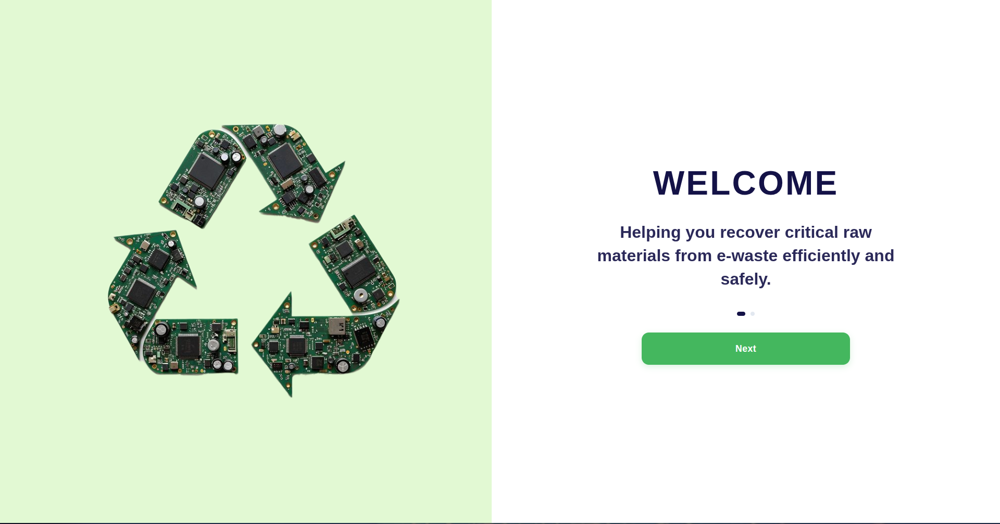
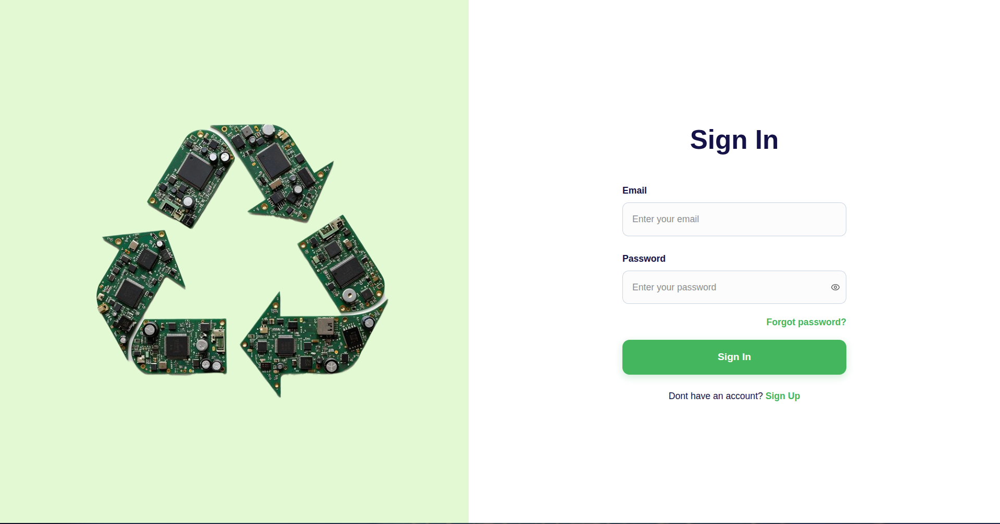


---

## Route Protection

Two layers work together to protect dashboard routes:

- **`middleware.ts`** — runs at the routing level and handles high-level redirect behavior for protected route segments.
- **`RequireAuth`** — a client-side guard component that reads the token from `localStorage`, validates it, and redirects unauthenticated or invalid sessions back to `signin` before rendering the wrapped page content.

Because the token lives in `localStorage` rather than a cookie, `RequireAuth` is the primary point where session validity is actually checked on the client; `middleware.ts` complements this for route-level handling.

If the stored token is malformed or cannot be decoded, the dashboard does not crash — it falls back to a default organization name (`"Welcome to E-madini"`) rather than blocking the page, while still loading orders and device data normally. This behavior is directly covered by the e2e test suite (see **Testing**, below).

---

## Core Dashboard Modules

| Route | Purpose |
| :--- | :--- |
| `dashboard/` | Landing page after login — recycler summary, greeting, quick stats |
| `DeviceScan/` | Upload/scan a device for AI-assisted identification |
| `materials-analysis/` | View material composition and recovery estimates for a scanned device |
| `orders/` | List of pickup orders/requests |
| `order-details/` | Detailed view of a single order |
| `profile/` | Recycler organization profile and account settings |
| `logout/` | Clears the stored session and redirects to `signin` |
| `welcome/` | First-login / post-onboarding welcome screen |

### Shared Components

- **`Sidebar`** — primary dashboard navigation
- **`RequireAuth`** — authentication guard wrapper (see above)
- **`LoadingSpinner`** — shown while dashboard data is being fetched (e.g. `"Loading your dashboard..."`)
- **`OrderDetailCard`** — renders a single order's details
- **`OrderStatusBadge`** — visual status indicator (e.g. pending, scheduled, completed) for an order

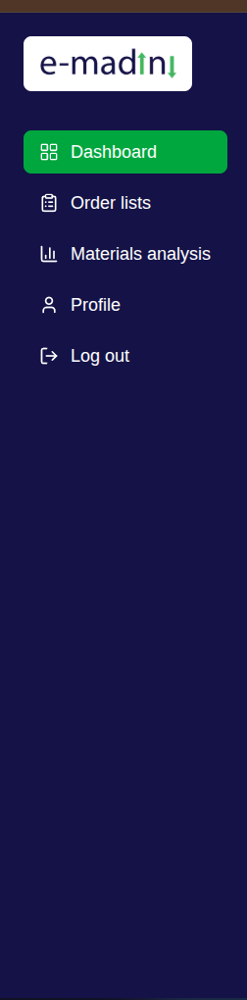
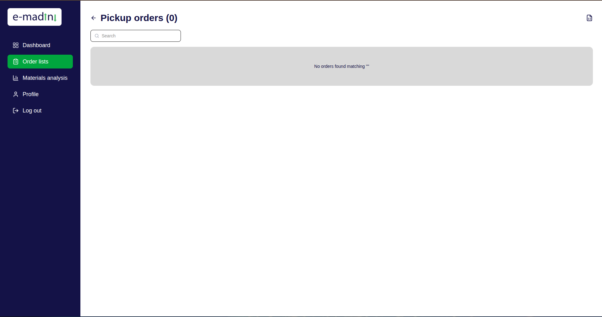
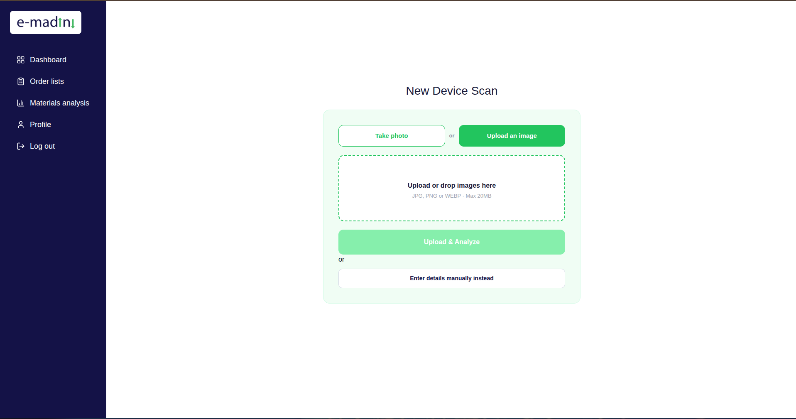
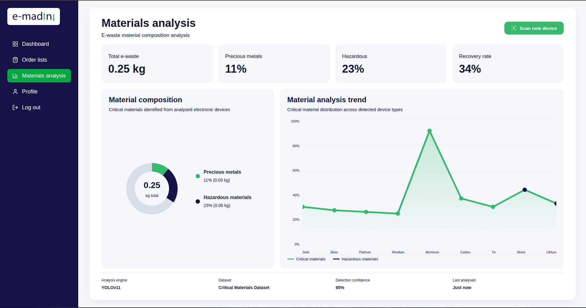
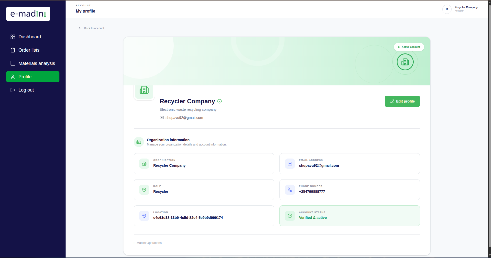

---

## API Communication

The Dashboard does not call the backend directly from components. Instead, requests go through a shared client under `app/lib/`, which centralizes the base URL, headers, and token attachment.

Example pattern:

```typescript
// app/lib/api.ts
const API_BASE_URL = process.env.NEXT_PUBLIC_API_BASE_URL;

export async function apiFetch(path: string, options: RequestInit = {}) {
  const token = localStorage.getItem("token");

  const response = await fetch(`${API_BASE_URL}${path}`, {
    ...options,
    headers: {
      "Content-Type": "application/json",
      ...(token ? { Authorization: `Bearer ${token}` } : {}),
      ...options.headers,
    },
  });

  if (!response.ok) {
    throw new Error(`Request failed: ${response.status}`);
  }

  return response.json();
}
```

Pages and components call this helper rather than using `fetch` directly, which keeps authentication headers and error handling consistent across the app.

```text
Component / Page
      |
      v
lib/api.ts (apiFetch)
      |
      v
FastAPI Backend (/orders, /device-models, /users, ...)
```

---

## Testing (End-to-End with Playwright)

The Recycler Dashboard is verified with Playwright end-to-end tests located under `e2e/`.

### Test Structure

```text
e2e/
├── dashboard.spec.ts
├── mocks/
│   ├── pickupRequests.ts
│   └── deviceModels.ts
└── utils/
    └── mockAuth.ts
```

- **`utils/mockAuth.ts`** exposes reusable helpers for simulating authenticated and unauthenticated sessions, including `mockAuthAndOrders`, `setFakeToken`, `mockOrdersRoute`, `mockDeviceModelsRoute`, and a `MALFORMED_TOKEN` fixture for edge-case testing.
- **`mocks/`** contains static fixture data (e.g. `mockPickupRequests`, `mockDeviceModels`) used to stub backend responses so tests do not depend on a live API.

### Example Spec

```typescript
import { test, expect } from "@playwright/test";
import {
  mockAuthAndOrders,
  setFakeToken,
  mockOrdersRoute,
  mockDeviceModelsRoute,
  MALFORMED_TOKEN,
} from "./utils/mockAuth";
import { mockPickupRequests } from "./mocks/pickupRequests";
import { mockDeviceModels } from "./mocks/deviceModels";

test.describe("Dashboard — Authentication", () => {
  test("DASH-AUTH-001: authenticated recycler lands on dashboard", async ({ page }) => {
    await mockAuthAndOrders(page);
    await page.goto("/dashboard");
    await page.waitForSelector('text="Loading your dashboard..."', { state: "hidden" });
    await expect(page).toHaveURL(/\/dashboard\//);
    await expect(page.getByRole("heading", { name: /Hello, Test Recycler Co./ })).toBeVisible();
  });

  test("DASH-AUTH-002: unauthenticated user is redirected", async ({ page }) => {
    await page.goto("/dashboard");
    await expect(page).not.toHaveURL(/\/dashboard\//);
  });

  test("DASH-AUTH-003: malformed token falls back to default org name", async ({ page }) => {
    await setFakeToken(page, MALFORMED_TOKEN);
    await mockOrdersRoute(page, mockPickupRequests);
    await mockDeviceModelsRoute(page, mockDeviceModels);
    await page.goto("/dashboard");
    await expect(page.getByRole("heading", { name: /Hello, Welcome to E-madini/ })).toBeVisible();
  });
});
```


### Running the Tests

```bash
npx playwright test
```

To run a single spec file:

```bash
npx playwright test e2e/dashboard.spec.ts
```

To open the interactive Playwright UI:

```bash
npx playwright test --ui
```


### Testing Areas Covered

- Authenticated vs unauthenticated route access
- Token validation and graceful fallback on malformed tokens
- Order data loading and rendering
- Device model data loading and rendering
- Loading states (spinner shown/hidden correctly)

---

# Informational Website

The Informational Website is the public entry point to E-Madini  it introduces the platform, its team, and its product, and provides a way for visitors to get in touch.

🔗 **Live site:** [Shupavu Informational Website](https://shupavu-website.vercel.app/)

## Page Composition

`page.js` composes the site from section-based components rather than separate routes, giving a single-page layout with in-page navigation:

| Component | Purpose |
| :--- | :--- |
| `Navbar` | Site navigation, including a responsive mobile menu |
| `Home` | Hero/landing section |
| `About` | Platform and mission overview |
| `Product` | Feature/product breakdown |
| `Team` | Team introduction |
| `Contact` | Contact form (Formspree-backed) |

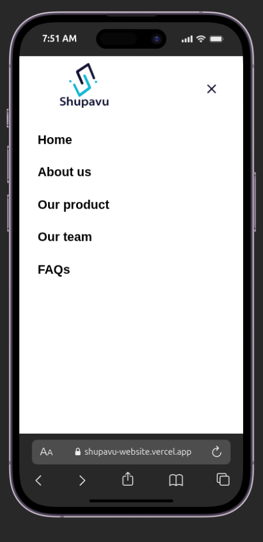
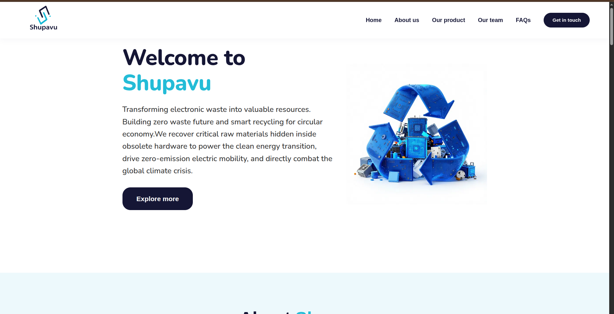
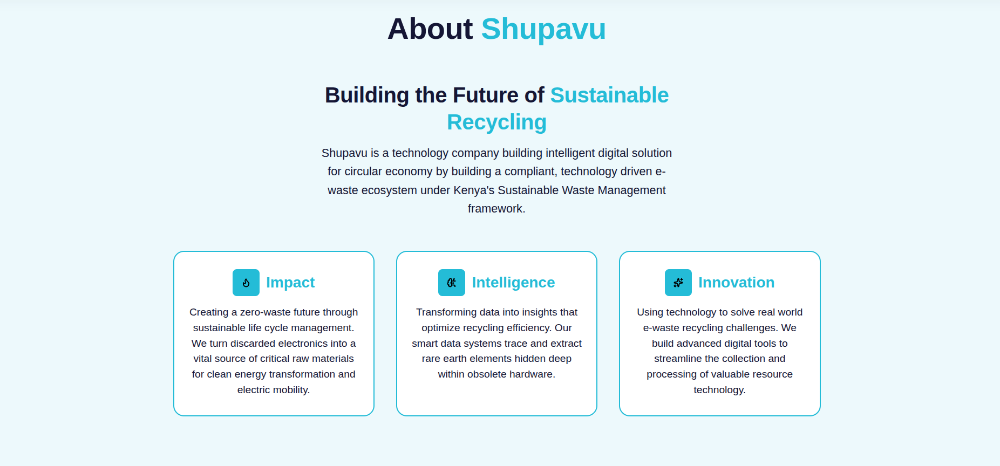
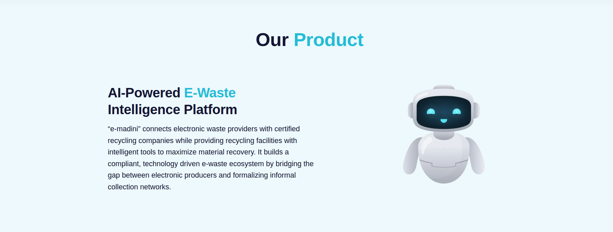

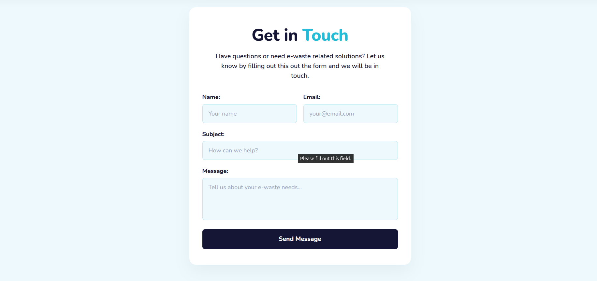

## Styling and Design Tokens

Each component pairs a `.jsx` file with a scoped `.module.css` file. Shared brand values (colors, radii) are defined as CSS custom properties, with local fallback values supplied in each module so components still render sensibly if a token isn't yet defined globally:

```css
.ctaButton {
  padding: 12px 28px;
  background-color: var(--color-secondary, #151635);
  color: var(--color-white, #ffffff);
  font-weight: 700;
  border-radius: var(--radius-pill, 999px);
  transition:
    background-color 0.2s ease,
    transform 0.1s ease;
}

.ctaButton:hover {
  background-color: var(--color-primary, #24bcd7);
}
```


## Responsive Navigation

The `Navbar` includes a mobile-specific toggle and menu, hidden by default and enabled at smaller breakpoints:

```css
.mobileToggle {
  display: none;
  background: transparent;
  border: none;
  color: var(--color-secondary, #151635);
  padding: 4px;
  cursor: pointer;
}
```


## Contributor Tooling

The repository includes `AGENTS.md` and `CLAUDE.md` files documenting conventions for AI-assisted development on this codebase contributors (human or AI pair-programming tools) should read these before making changes.

---

## Testing (Cypress)

The Informational Website is verified with Cypress for UI and interaction testing  form submission, navigation, and responsive behavior.

### Test Structure

```text
cypress/
├── e2e/
│   ├── navbar.cy.js
│   ├── contact-form.cy.js
│   └── responsive.cy.js
├── fixtures/
└── support/
```

### Example Spec

```javascript
describe("Contact Form", () => {
  it("submits successfully with valid input", () => {
    cy.visit("/");
    cy.get('[data-testid="contact-name"]').type("Test User");
    cy.get('[data-testid="contact-email"]').type("test@example.com");
    cy.get('[data-testid="contact-message"]').type("Hello E-Madini");
    cy.get('[data-testid="contact-submit"]').click();
    cy.contains("Message sent").should("be.visible");
  });
});
```


### Running the Tests

```bash
npx cypress open
```

Headless (CI mode):

```bash
npx cypress run
```

### Testing Areas Covered

- Navbar links and mobile menu toggle
- Contact form validation and successful submission
- Responsive layout across breakpoints

# Environment Variables

## Recycler Dashboard

```text
NEXT_PUBLIC_API_BASE_URL= https://emadini-085ca7dade35.herokuapp.com
```

## Informational Website

```text
NEXT_PUBLIC_FORMSPREE_ENDPOINT= https://formspree.io/f/xqevvnjb
```

Neither `.env` file should be committed. Use an `.env.example` with empty values instead.

---

# Running Locally

From either project directory:

```bash
npm install
npm run dev
```

The Dashboard is served at:

```text
http://localhost:3000
```

Before running the Dashboard locally, confirm:

```text
[ ] Dependencies installed (npm install)
[ ] .env.local configured with NEXT_PUBLIC_API_BASE_URL
[ ] Backend API is running and reachable
```

---

# Git Branching Strategy

Frontend development follows the same feature-branch workflow as the backend:

```text
feature/dashboard-orders-page
feature/faq-section
bugfix/navbar-mobile-menu
```

```text
main
 |
 +---- feature/branch-name
 |
 |     Development + local testing
 |
 +---- Pull Request
 |
 +---- Review
 |
 +---- Merge
```

---

# Pull Request Checklist

Before opening a pull request for either web application:

```text
[ ] Feature/fix is complete
[ ] Code follows the existing project structure
[ ] Playwright tests updated/added (Dashboard)
[ ] Existing tests pass (npx playwright test)
[ ] No secrets or tokens committed
[ ] Environment variables documented
[ ] Responsive layout checked (mobile + desktop)
[ ] Lint/formatting checks pass
```

---

# Deployment

Both applications deploy to **Vercel**.

```text
Local Development
       |
       v
Git Commit
       |
       v
GitHub
       |
       v
Vercel (build + deploy)
       |
       v
Production (Dashboard / Website)
```

Environment variables (e.g. `NEXT_PUBLIC_API_BASE_URL`) must be configured in the Vercel project settings  not committed to the repository.


## Production Verification

After deployment, verify:

```text
[ ] Website loads and all sections render
[ ] Contact form submits successfully
[ ] Dashboard signin/signup flow works end-to-end
[ ] Dashboard correctly redirects unauthenticated users
[ ] Dashboard successfully calls the production API
[ ] Device scanning and order pages load real data
```

---

# Common Development Issues

## Dashboard redirects to signin unexpectedly

Check that:

```text
localStorage contains a valid token
Token has not expired
NEXT_PUBLIC_API_BASE_URL points to a reachable backend
```

## "Loading your dashboard..." never disappears

Usually indicates the API request in `lib/api.ts` failed silently or the backend is unreachable. Check the network tab and backend logs.

## CORS errors when calling the backend

Confirm the backend's CORS configuration allows the Dashboard's origin (localhost during development, the Vercel domain in production).

## Mobile menu not appearing

Check the CSS breakpoint controlling `.mobileToggle` / `.mobileMenu` in `Navbar.module.css` — a mismatched breakpoint is the most common cause.

## Hydration mismatch warnings

Usually caused by reading `localStorage` (browser-only) during server rendering. Ensure token reads happen inside `useEffect` or other client-only lifecycle points, not during the initial render.

---

# Frontend Web Quality Standards

Every contribution to either web application should aim for:

- Consistent use of the shared `lib/api.ts` client for all backend calls (Dashboard)
- Clear separation between layout, page, and reusable components
- Responsive design verified on mobile and desktop
- Meaningful loading and error states
- Playwright coverage for new authenticated flows (Dashboard)
- No secrets committed to the repository
- Consistent use of shared design tokens (Informational Website)

---

# Summary

The E-Madini web layer gives recyclers a secure, functional workspace and gives the public a clear introduction to the platform.

Its main responsibilities are to:

1. Authenticate recyclers and protect dashboard routes.
2. Present device scanning, material analysis, and pickup order workflows.
3. Communicate reliably with the FastAPI backend through a shared API client.
4. Verify critical flows automatically through Playwright end-to-end tests.
5. Introduce E-Madini's mission, product, and team to the public.
6. Maintain a consistent brand identity across both applications.
7. Deploy reliably and repeatably through Vercel.